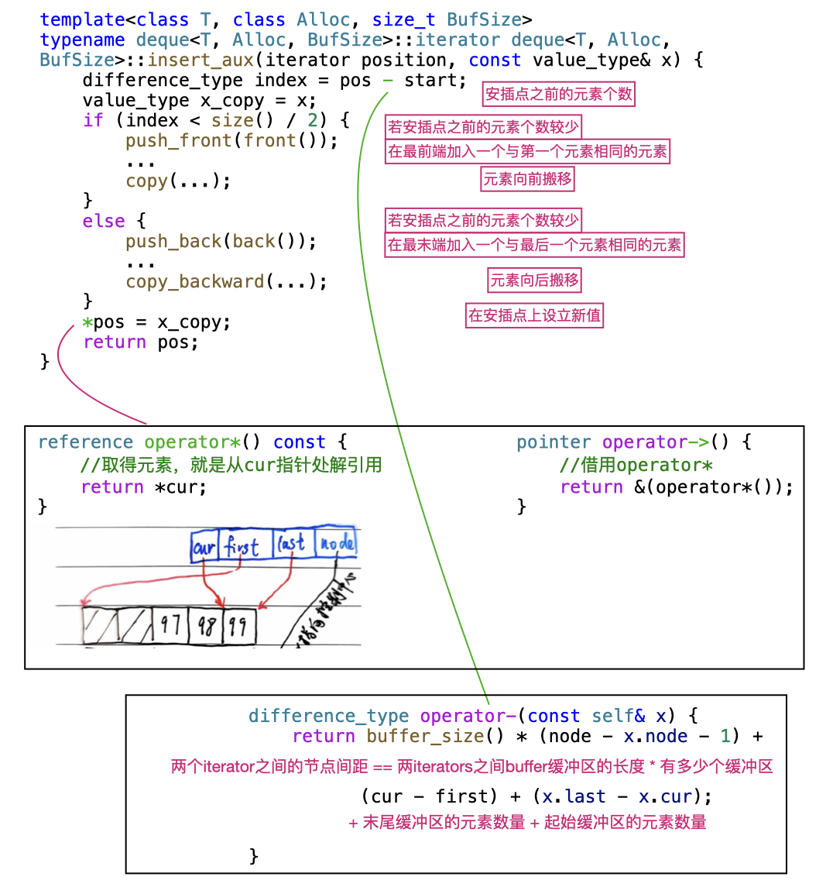

# 深度探索list


我们希望iterator模拟指针，因为list是非连续空间，`node++`毫无意义，它不知道加到（指向）何处，必须要进入node内部，调用next指针才行，即`(*node).next`

**list的迭代器**


### iterator 设计原则

iterator必须有能力回答algorithm的提问

比如知晓容器迭代器的分类以便高效选择（∵有些容器的迭代器只能++或--，而有的可以跳跃等），可以使用iterator_traits萃取出iterator_category，或者知晓迭代器之间的不同类型：iterator_traits<T>::difference_type，知晓迭代器元素类型：iterator_traits<T>::value_type;

**iterator必须提供的五种相关类型**


但如果iterator不是class而是一个退化的iterator呢？

定义一个萃取机制，使其有能力分辨是iterator还是pointer----利用偏特化即可解决


**完整版：**


# 探索vector


**尾插push_back**


**iterator的设计**


# 深度探索Array

**用法示例**

```cpp
std::array<int, 10> myArray;
auto ite = myArray.begin();
ite += 3;
*ite;
```

**C++98版本**


**C++14版本**


# deque

**deque图示**


**deque类设计**


**deque<T>::insert()**

说明：在迭代器position处安插一个元素，值为x。同时这也是迭代器智能的一种体现

```cpp
iterator insert(iterator position, const value_type& x) {
    if (position.cur == start.cur) { //安插点在deque的最前端
        push_front(x);
        return start;
    } else if (position.cur == finish.cur) { //尾插
        push_back(x);
        iterator tmp = finish;
        --tmp;
        return tmp;
    } else {
        return insert_aux(position, x); //insert_aux定义见下面图片
    }
}
```



```cpp
//insert_aux()剩余的函数定义如下：

reference operator[](size_type n) {
    return start[difference_type(n)];
}
reference front() {
    return *start;
}
reference back() {
    //因为finish指向后一个元素的下一个位置
    iterator tmp = finish;
    --tmp; //--也要重载
    return *tmp;
}
size_type size() {
    return finish - start; //-已经重载过了
}
bool empty() {
    return finish == start;
}
```

**deque如何模拟连续空间？**

deque的自增/自减


deque有连续加减功能


deque的类图


